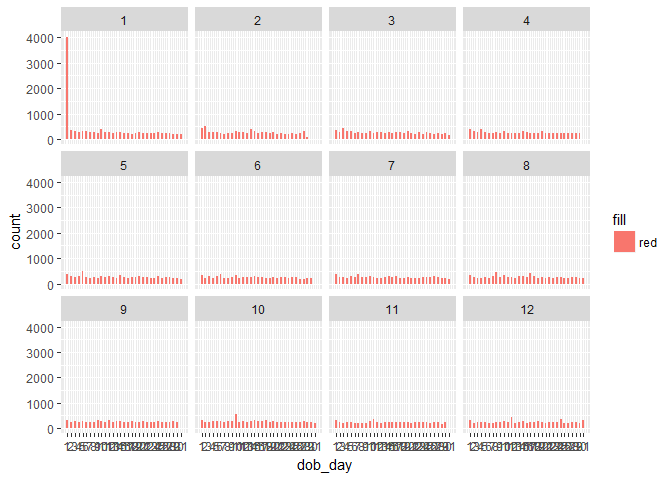
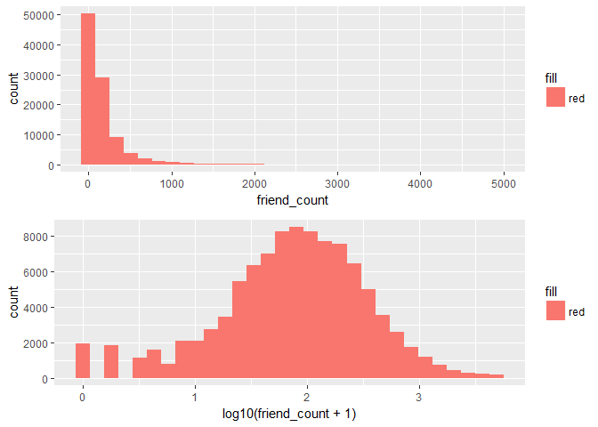
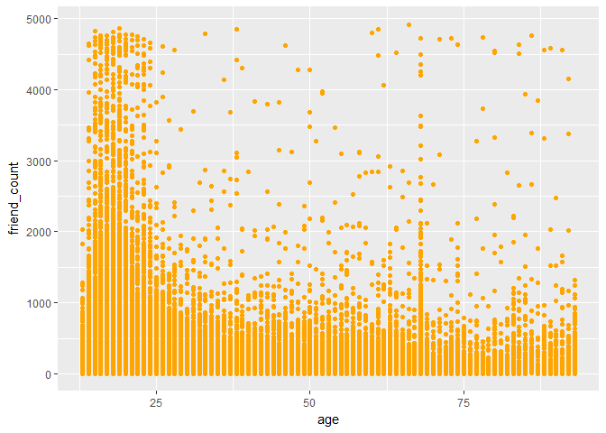
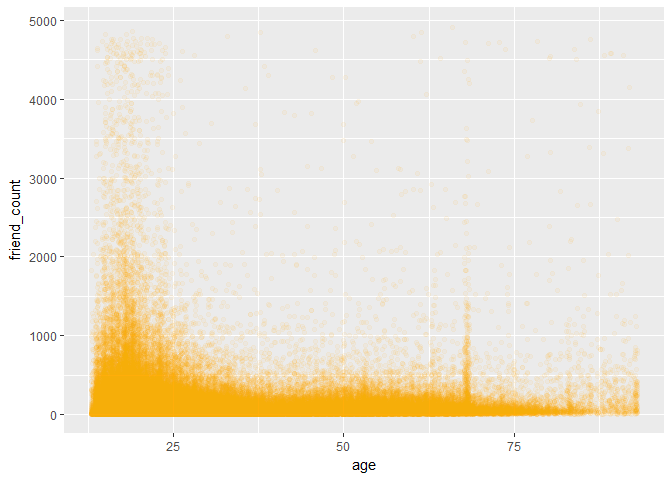
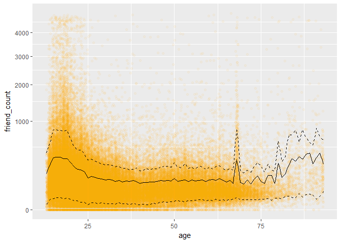

I am analyzing psuedo facebook data which means this data has been modified for security reasons.This data has 99003 records and 15 attributes. The attrributes are as follows: "userid","age","dob\_day", "dob\_year", "dob\_month", "gender", tenure", "friend\_count", "friendships\_initiated", "likes", "likes\_received", "mobile\_likes", "mobile\_likes\_received", "www\_likes", "www\_likes\_received"

Import Data
-----------

``` r
fd = read.csv('pseudo_facebook.tsv',sep ='\t')
```

Histogram of Birthday
---------------------

31st of of every month has low count which makes sense as not every month has 31 days 1st day of month had a huge peak which seemed weird.

``` r
# install.packages('ggplot2')
library(ggplot2)
qplot(x= dob_day, data = fd, binwidth = .5, fill = 'red') + 
  scale_x_continuous(breaks = 1:31)
```


Later I tried to dive in further to get more insights. I saw that most of the peak is for 1st January which could be a default setting for the users who did not add their birthdays.

``` r
qplot(x= dob_day, data = fd, binwidth = .5,fill = 'red') + 
  scale_x_continuous(breaks = 1:31) +
  facet_wrap(~dob_month)
```



Histogram of Friendcount
------------------------

Its a right skewed data with most entries in the range of 0 to 1000

``` r
qplot(x= friend_count, data = fd, binwidth = 3,fill = 'red')
```


Setting a limit on axis

``` r
qplot(x= friend_count, data = fd, binwidth = 10,fill = 'red') + 
  scale_x_continuous(limits = c(0,1000))
```


Analyzing friend count by gender 

statistics by gender solution
=============================

``` r
by(fd$friend_count, fd$gender, summary)
```

    ## fd$gender: female
    ##    Min. 1st Qu.  Median    Mean 3rd Qu.    Max. 
    ##       0      37      96     242     244    4923 
    ## -------------------------------------------------------- 
    ## fd$gender: male
    ##    Min. 1st Qu.  Median    Mean 3rd Qu.    Max. 
    ##       0      27      74     165     182    4917

log transformation works better on skewed data
==============================================

``` r
p = qplot(x= friend_count, data = fd, fill = 'red')
p1 = qplot(x= log10(friend_count + 1), data = fd, fill = 'red')
#install.packages('gridExtra')
library(gridExtra)
grid.arrange(p,p1, ncol = 1)
```

    ## `stat_bin()` using `bins = 30`. Pick better value with `binwidth`.
    ## `stat_bin()` using `bins = 30`. Pick better value with `binwidth`.



Frequency Polygon to comapare counts histograms by gender
=========================================================

``` r
ggplot(aes(x = friend_count, y = ..count../sum(..count..)), data = subset(fd, !is.na(gender))) + 
  geom_freqpoly(aes(color = gender), binwidth=10) + 
  scale_x_continuous(limits = c(0, 1000), breaks = seq(0, 1000, 50)) + 
  xlab('Friend Count') + 
  ylab('Percentage of users with that friend count')
```


Analyzing likes by gender
=========================


Analysis to see who initiates a friend request on an average
============================================================


checking if facebook should concerntrate on their mobile app
============================================================

For this we can check what percent of people actually use facebook on their mobile This can be found out using mobile\_like attribute in the dataset.

    ## 
    ##     0     1 
    ## 35056 63947

This tells that more than 50 percent people use facebook on mobile

Analyzing Friend counts conditional on age
==========================================



As there are too many points let us understand the density of the points in the graph. Let us reduce the effect of overplotting 

It seems that data points are mostly concerntrated in friend\_count range of (0,1000) and age range of (0,75)

Now let us have a look at the quantile distribution of the data Let us reduce the effect of overplotting 
